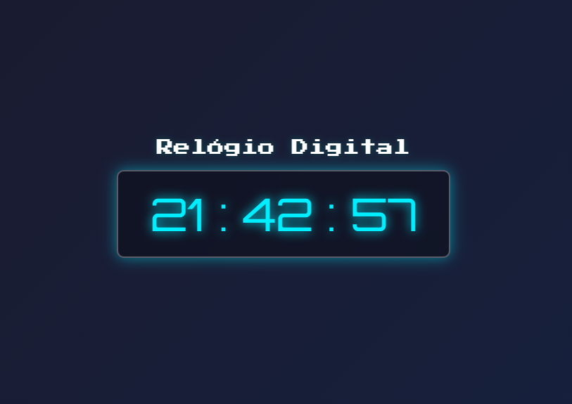

# Matheus Correia - Relógio Digital

Estruturei o relógio com HTML5, apliquei um estilo com fontes futuristas do Google Fonts com CSS3, usei o JavaScript para atualizar a hora em tempo real, apliquei a função padStart() para formatar os números corretamente, e o 'setInterval' para atualização automática.

## Visão Geral

### Captura de Tela

### Links

- URL do Site Ativo: [aqui](https://matheuscorreiadev.github.io/digital-clock/)

## Meu Processo

### Construído com

- HTML5 
- CSS3
- JavaScript
- Google Fonts: Orbitron e Press Start 2P
